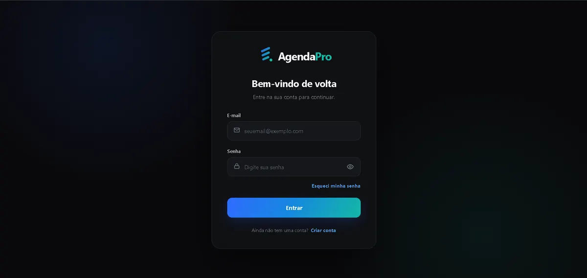

# AgendaPro

AgendaPro é uma aplicação web de agendamento e gestão de compromissos desenvolvida para pequenos negócios e profissionais que precisam organizar clientes, serviços, horários e agendamentos em um único lugar.

A aplicação conta com autenticação, painel administrativo, agenda, cadastro de clientes e serviços, página pública de agendamento, gerenciamento de agendamentos por link e envio de e-mails transacionais.

## Demo

Aplicação em produção:

https://agendapro-umber.vercel.app

## Interface

### Visão geral


### Agenda


### Login



### Agendamento público


## Principais funcionalidades

- Autenticação com login, cadastro, recuperação e redefinição de senha
- Dashboard com visão geral dos agendamentos e indicadores
- Cadastro, edição e exclusão de clientes
- Cadastro, edição e gerenciamento de serviços
- Criação, edição e atualização de status de agendamentos
- Página pública de agendamento por slug
- Seleção de serviço, data e horário disponível
- Cancelamento e reagendamento por link individual
- Notificações no dashboard
- E-mails transacionais de confirmação e atualização de agendamento
- Configuração de perfil, slug público e horários de funcionamento
- Interface responsiva para desktop, tablet e celular
- Tema dark premium com identidade visual própria

## Tecnologias

### Front-end

- React
- TypeScript
- Vite
- CSS
- Lucide React

### Back-end e infraestrutura

- Supabase
  - PostgreSQL
  - Authentication
  - Row Level Security
  - Realtime
  - Edge Functions
- Resend para e-mails transacionais
- Vercel para deploy do front-end
- Git e GitHub para versionamento

## Arquitetura do projeto

```text
AgendaPro/
├── docs/
│   └── screenshots/
├── frontend/
│   ├── src/
│   │   ├── assets/
│   │   ├── components/
│   │   ├── lib/
│   │   └── pages/
│   ├── public/
│   └── package.json
├── supabase/
│   ├── functions/
│   └── migrations/
└── README.md
```

## Fluxo da aplicação

O profissional acessa o painel autenticado para configurar seus serviços, clientes, horários de funcionamento e agenda.

Cada conta pode disponibilizar uma página pública de agendamento. O cliente escolhe o serviço, a data e um horário disponível, informa seus dados e confirma o agendamento.

Após a criação, o sistema registra o compromisso no banco, atualiza o painel do profissional, gera notificações e pode enviar uma confirmação por e-mail. O cliente também recebe um link individual para cancelar ou reagendar o compromisso.

## Executando localmente

### Pré-requisitos

- Node.js
- npm
- Projeto Supabase configurado

Clone o repositório:

```bash
git clone https://github.com/Will0589b/Agendapro.git
cd Agendapro/frontend
```

Instale as dependências:

```bash
npm install
```

Crie um arquivo `.env` no diretório `frontend` com:

```env
VITE_SUPABASE_URL=seu_supabase_url
VITE_SUPABASE_PUBLISHABLE_KEY=sua_chave_publica
```

Inicie o ambiente de desenvolvimento:

```bash
npm run dev
```

Para gerar o build de produção:

```bash
npm run build
```

## Rotas principais

```text
/                      Área autenticada
/agendar/:slug         Página pública de agendamento
/agendamento/:token    Gerenciamento do agendamento
```

## Segurança

O AgendaPro utiliza autenticação do Supabase e políticas de Row Level Security para limitar o acesso aos dados pertencentes a cada usuário.

Credenciais e chaves privadas não são armazenadas no código-fonte. Configurações sensíveis devem ser definidas através de variáveis de ambiente e secrets da infraestrutura.

## Status

MVP funcional e publicado.

Os principais fluxos da aplicação foram implementados e testados, incluindo autenticação, gestão de agenda, agendamento público, cancelamento, reagendamento e envio de e-mails transacionais.

## Autor

Desenvolvido por William Alencar de Sousa.

GitHub: https://github.com/Will0589b
